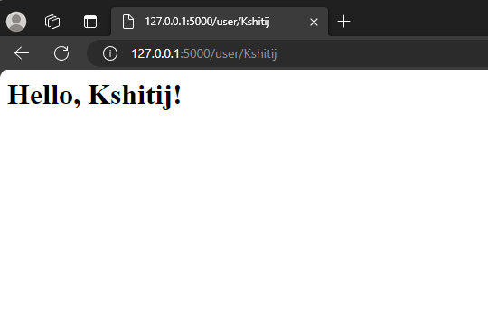
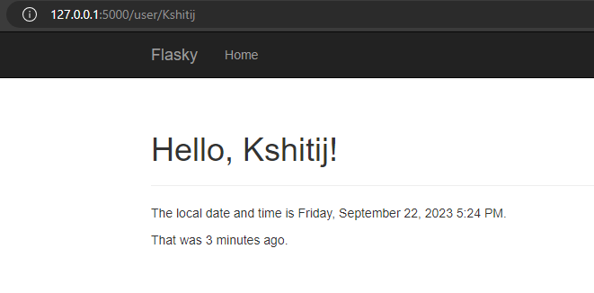
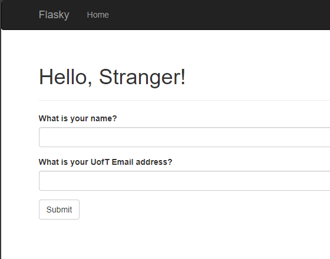
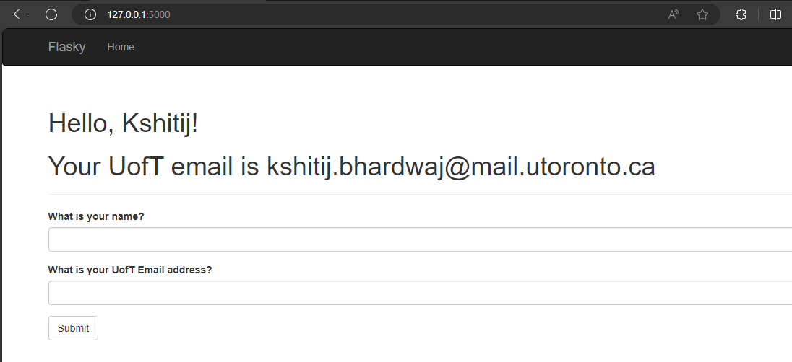
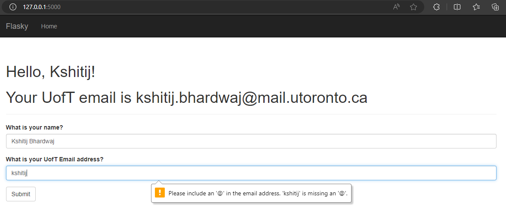
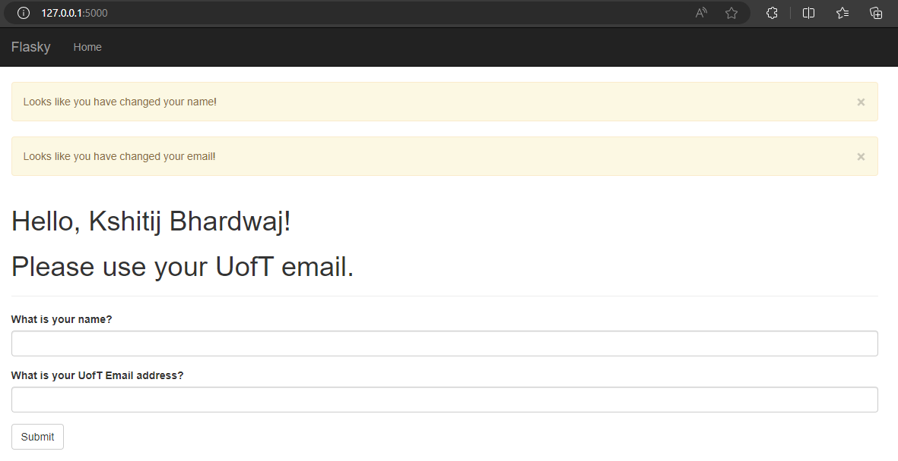

# ECE444-F2023-Lab1

Activity1:

Activity 2:

Acknowledgement: this repo is a clone of https://github.com/miguelgrinberg/flasky

Example 2-1:

Example 2-2:

Activity 3:

Activity 4a:

Activity 4b:

Activity 4c:

Activity 4d:

